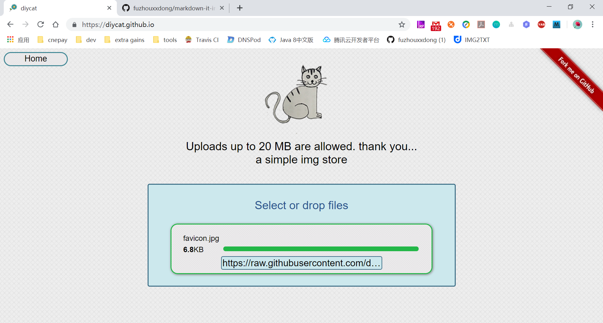

# 一个hexo博客img store的简单解决方案



### 克隆项目

```
git clone https://github.com/fuzhouxxdong/github-image-stroe.git
```

### 安装项目依赖
```
yarn install
```

### 配置github信息
src\utils\global.js 
```
exports.install = function (Vue) {
    Vue.prototype.github = {
        client_id: 'your client id',
        client_secret: 'your client secret',
        name: 'your github username',
        email: 'your github email',
        owner: 'repos owner',
        repos: 'repos'
    }
};
```
创建一个github授权[creating-an-oauth-app](https://developer.github.com/apps/building-oauth-apps/creating-an-oauth-app/)

### 启动项目
```
yarn run serve
```

效果[diycat](https://diycat.github.io)

### 构建项目
```
yarn run build
```

### 发布项目
```
yarn run deploy
```
默认发布到mater,想要发布到gh_pages,修改package.json

```
vcg --message='Update live demo' --branch=master --repo=https://github.com/diycat/diycat.github.io.git
```
此项目请配合[markdown-it-image](https://github.com/fuzhouxxdong/markdown-it-image)食用
### License
MIT
